# Roam Technical Diagrams (10 Pages)

This document provides a 10-page technical diagram set for how the Roam app works end-to-end.

---

## Page 1 - System Architecture Overview

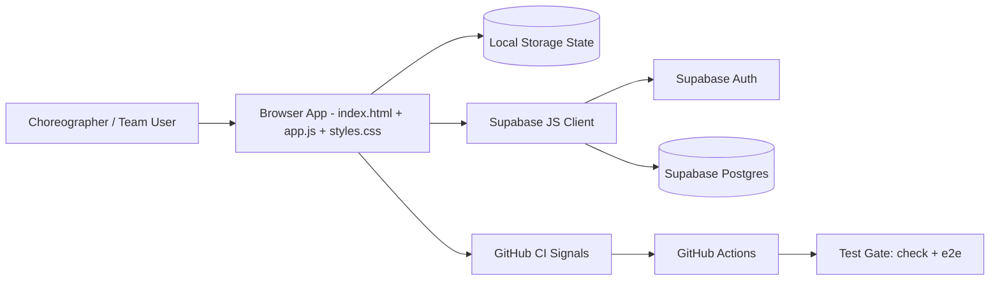

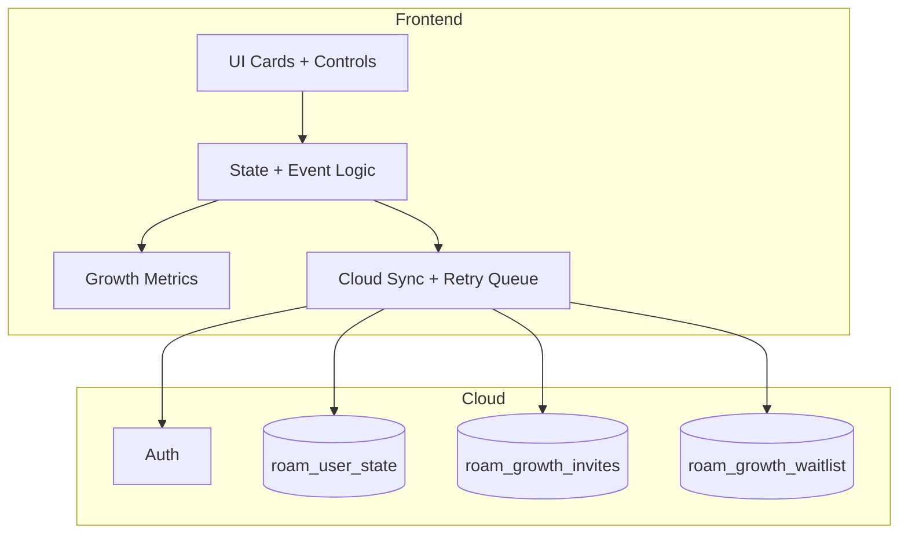

---

## Page 2 - Frontend Module Map

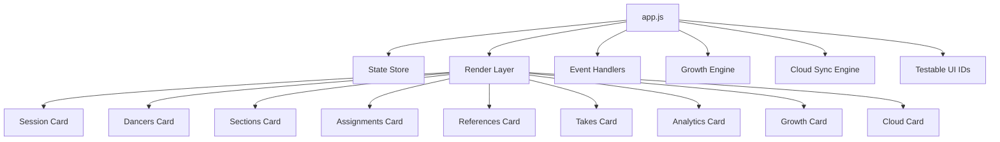

```mermaid
classDiagram
  class AppState {
    locale
    session
    dancers[]
    sections[]
    assignments[]
    references[]
    takes[]
    onboarding{}
    cloud{}
    growth{}
  }

  class CloudState {
    url
    anonKey
    user
  }

  class GrowthState {
    referralCode
    inviteLog[]
    waitlist[]
    sharePacksGenerated
    pendingCloudWrites[]
    attribution{}
    events[]
  }

  AppState --> CloudState
  AppState --> GrowthState
```

---

## Page 3 - Core Choreography Workflow

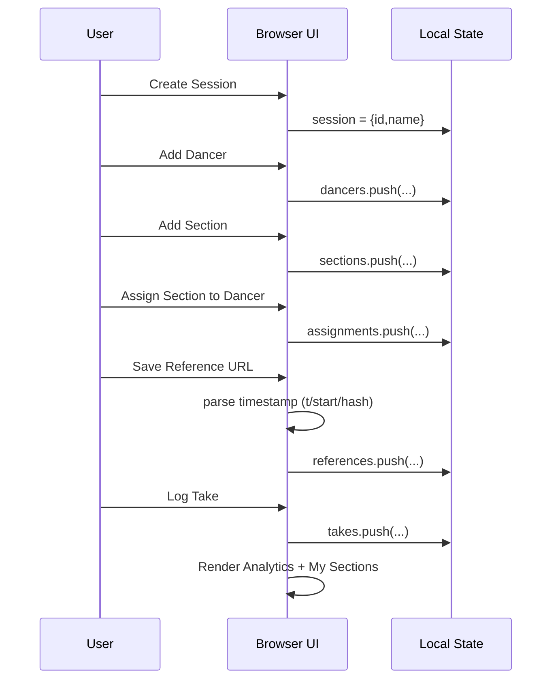

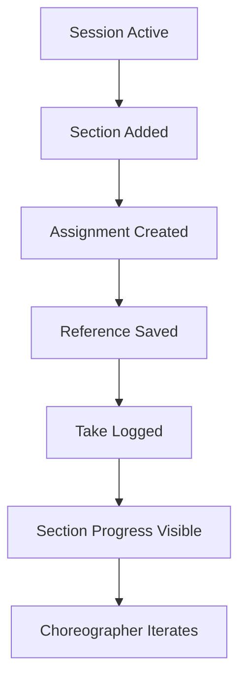

---

## Page 4 - Data Model and Relationships

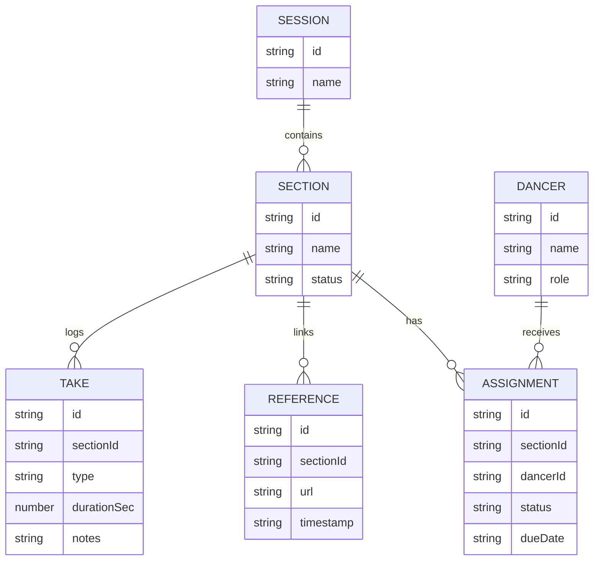

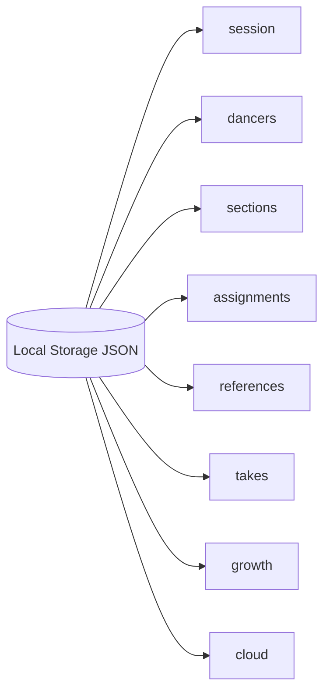

---

## Page 5 - Sync and Retry Queue

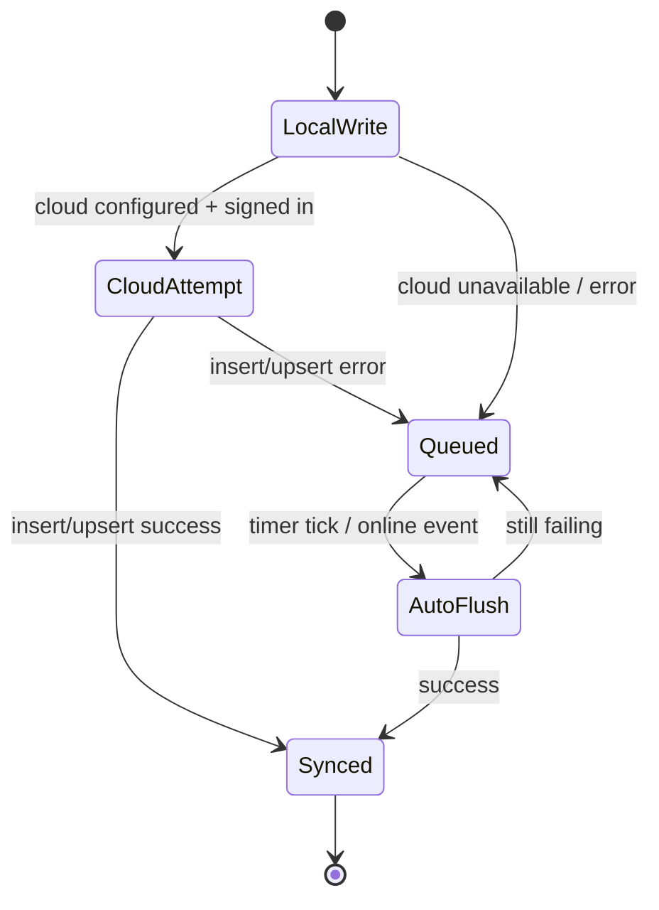

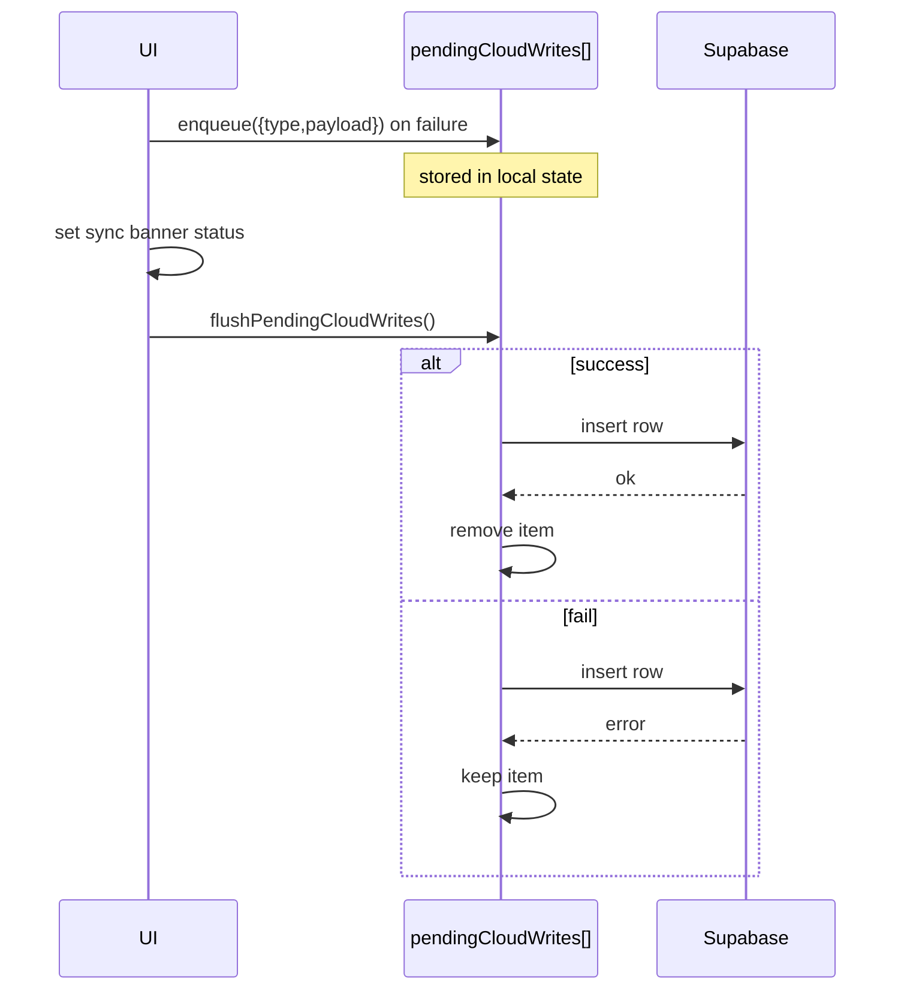

---

## Page 6 - Growth Engine and Attribution

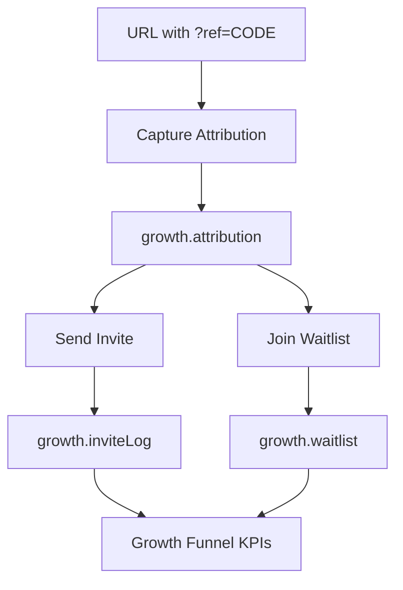

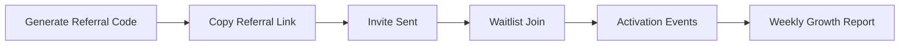

---

## Page 7 - Share Pack Collaboration Flow

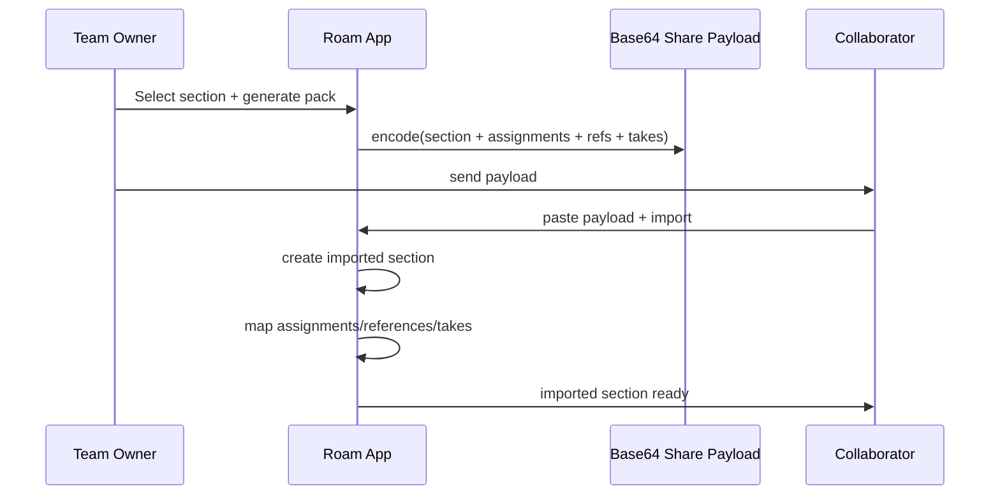

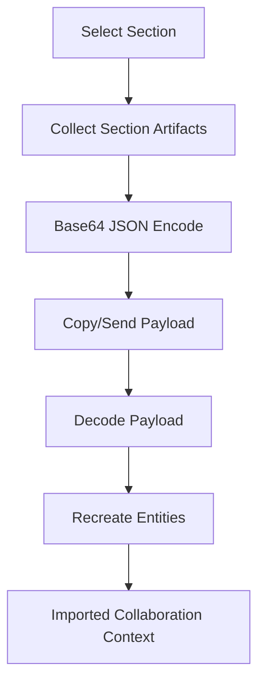

---

## Page 8 - Security and RLS Model

```mermaid
flowchart LR
  Browser[Browser Client]
  Browser -->|publishable/anon key| Supabase[Supabase]
  Browser -.x.|never use| ServiceRole[Service Role Key]
  Supabase --> Auth[Auth Session]
  Auth --> RLS[RLS Policies]
  RLS --> UserState[(roam_user_state)]
  RLS --> GrowthInv[(roam_growth_invites)]
  RLS --> Waitlist[(roam_growth_waitlist)]
```

```mermaid
flowchart TD
  U[Authenticated User] --> P1{Policy Check}
  P1 -->|auth.uid() == user_id| RW1[Read/Write Own State]
  P1 -->|otherwise| Deny1[Deny]

  U --> P2{Invite Policy}
  P2 -->|auth.uid() == owner_user_id| W2[Insert/Read own invites]
  P2 -->|otherwise| Deny2[Deny]

  V[Anon or Auth Visitor] --> P3{Waitlist Insert}
  P3 -->|allowed by policy| W3[Insert Waitlist Lead]
```

---

## Page 9 - CI/CD and Test Gate

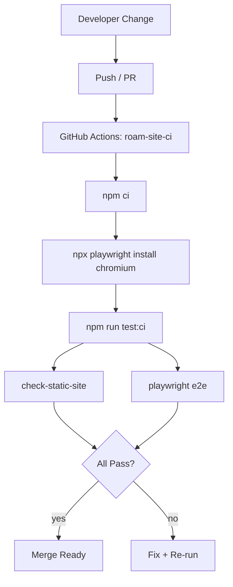

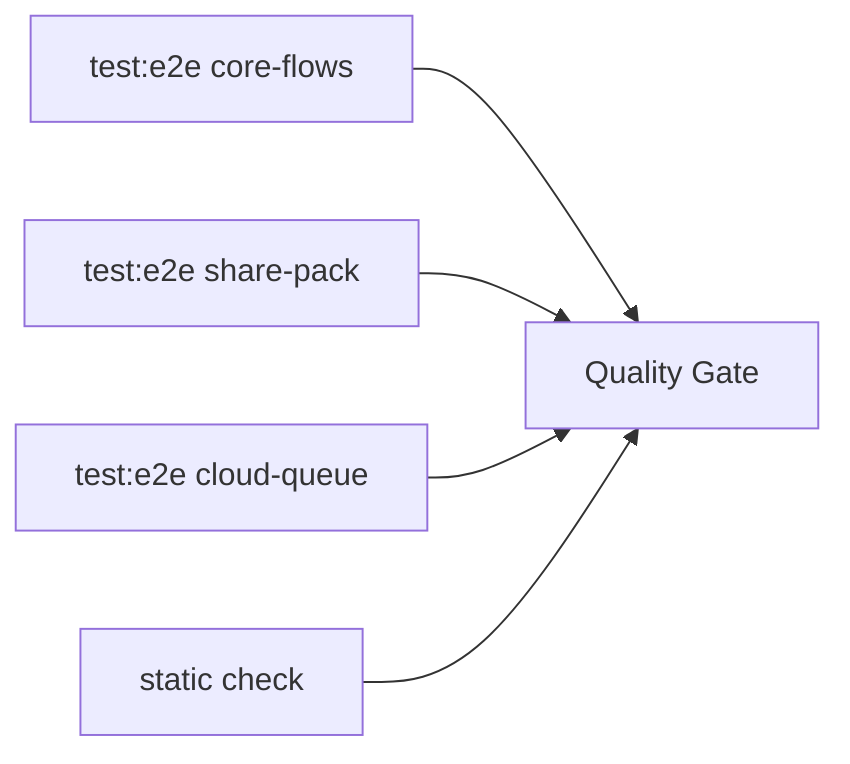

---

## Page 10 - Operations and Runbook View

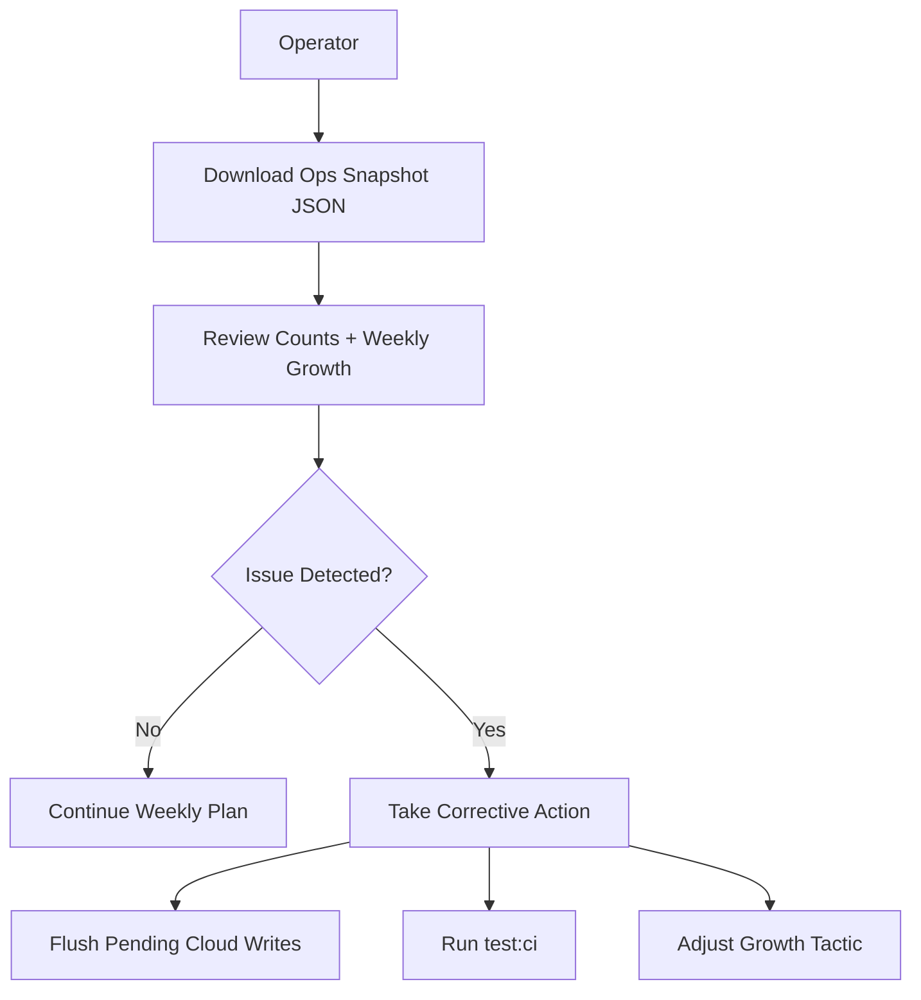

```mermaid
stateDiagram-v2
  [*] --> Pilot
  Pilot --> Repeatable : hit 50-user gate
  Repeatable --> Scale : hit 200-user gate
  Scale --> Thousand : hit 1000-user gate
  Pilot --> PilotFix : activation drops
  Repeatable --> RepeatFix : invite conversion drops
  Scale --> ScaleFix : reliability regressions
  PilotFix --> Pilot
  RepeatFix --> Repeatable
  ScaleFix --> Scale
```

---

## Appendix - Legend

- **Local State**: browser persisted app JSON.
- **Pending Cloud Writes**: queued invite/waitlist writes for retry.
- **Activation**: completion of first-session choreography-critical steps.
- **Share Pack**: encoded portable section context for collaboration.
